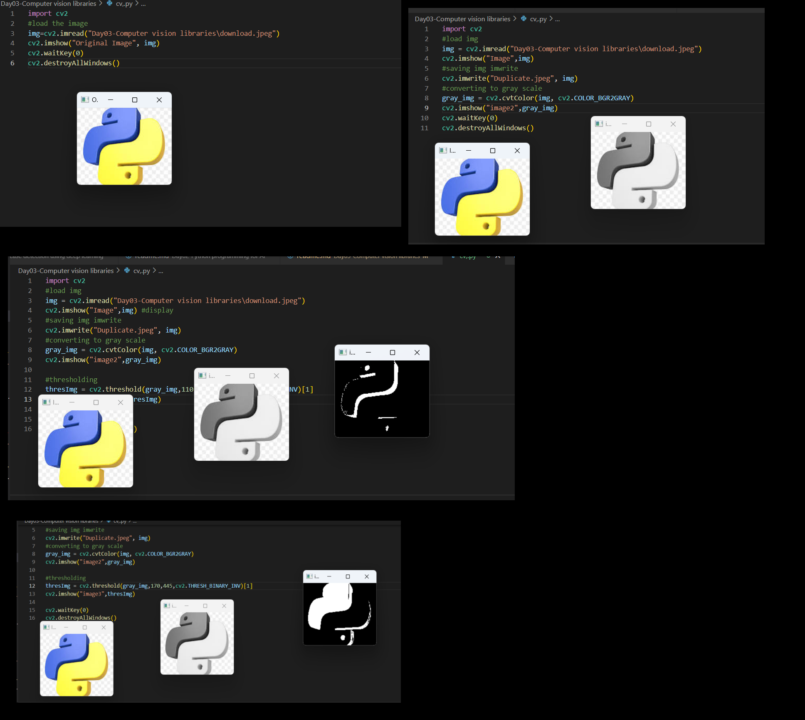

# Computer Vision with OpenCV Library

This README.md file provides an overview of basic Computer Vision concepts and demonstrates how to perform grayscale conversion, binary image generation, and thresholding using the OpenCV library in Python.

## Concepts

### Grayscale Image
A grayscale image is an image in which each pixel value represents the intensity of light, typically ranging from 0 (black) to 255 (white). It is commonly used in image processing and computer vision applications, as it simplifies image analysis by reducing color information to a single intensity value per pixel.

### Binary Image
A binary image is an image that consists of pixels that are either black (0) or white (255) with no intermediate shades of gray. It is useful for tasks such as object segmentation and feature extraction, as it simplifies image representation by reducing complexity to only two levels of intensity.

### Thresholding
Thresholding is a technique used to create binary images by segmenting an image based on pixel intensity values. It involves comparing each pixel's intensity value to a specified threshold and setting the pixel to black or white based on whether it is above or below the threshold, respectively. Thresholding is commonly used for image segmentation to separate objects or regions of interest from the background.

