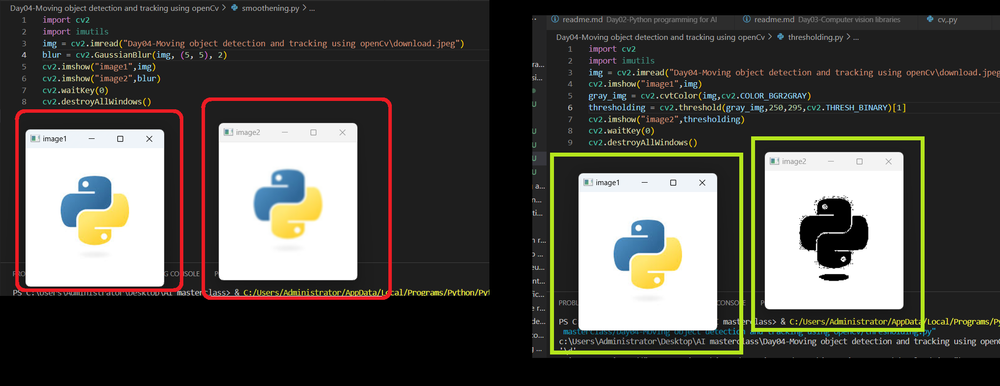
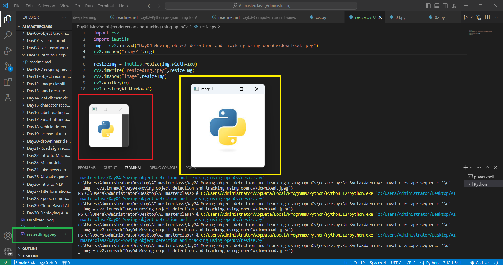

# OpenCV Motion Detection Script

## Description
This script utilizes OpenCV, a popular computer vision library, to detect moving objects in a video feed captured by a webcam. When a moving object is detected, bounding boxes are drawn around them.

## Requirements
- Python 3.x
- OpenCV (cv2)
- imutils

## Installation
1. Install Python 3.x from [python.org](https://www.python.org/downloads/).
2. Install OpenCV by running: `pip install opencv-python`.
3. Install imutils by running: `pip install imutils`.

## Usage
1. Connect a webcam to your computer.
2. Run the script.
3. The webcam feed will open, and any detected moving objects will be highlighted with bounding boxes.
4. Press 'q' to exit the script.

## Customization
- You can adjust the `area` variable to change the minimum contour area required for an object to be considered significant movement.
- Modify the thresholding parameters (`cv2.threshold`) for fine-tuning the sensitivity to motion.

## Definitions
- **OpenCV (Open Source Computer Vision Library)**: OpenCV is a popular open-source computer vision and machine learning software library. It provides a wide range of functionalities for image and video processing, including object detection, tracking, and recognition.

- **Computer Vision**: Computer vision is a field of artificial intelligence and computer science that focuses on enabling computers to interpret and understand visual information from the real world. It involves developing algorithms and techniques for tasks such as image and video processing, object detection, facial recognition, and scene understanding.

## Notes
- Ensure proper lighting conditions for optimal detection.
- This script serves as a basic example and can be expanded for more complex applications.

